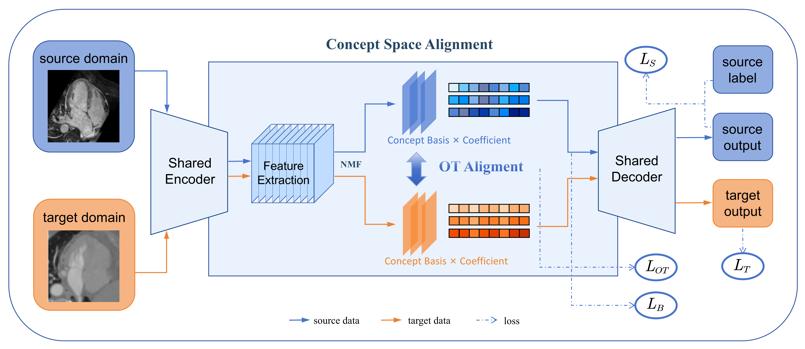

# OTCA: Unsupervised Domain Adaptation for Cross-Modal Medical Image Segmentation via OT-Based Concept Alignment
> An Easy Implementation for unsupervised domain adaptation in medical image segmentation, combining Non-negative Matrix Factorization (NMF) and Optimal Transport (OT) for cross-domain concept alignment.

[](https://opensource.org/licenses/MIT)
[](https://www.python.org/)
[](https://pytorch.org/)
[](https://developer.nvidia.com/cuda-toolkit)
[](https://github.com/TangMeng111/OTCA)

<!-- ## Table of Contents
- [Overview](#overview)
- [Key Features](#key-features)
- [Installation](#installation)
- [Usage](#usage)
  - [Training](#training)
  - [Inference](#inference)
  - [Evaluation](#evaluation)
- [Experimental Results](#experimental-results)
- [Citation](#citation)
- [Contributing](#contributing)
- [License](#license)
- [Acknowledgements](#acknowledgements)
-->

## Overview
This project addresses the domain shift challenge in medical image segmentation, where models trained on labeled source domains fail to generalize to unlabeled target domains. We propose a novel unsupervised domain adaptation (UDA) approach that leverages:
- **Non-negative Matrix Factorization (NMF)** to extract semantic concepts from medical images.
- **Optimal Transport (OT)** to align these concepts across source and target domains without target annotations.


*Figure 1: Schematic diagram of our NMF-OT based unsupervised domain adaptation framework.


## Key Features
- 🚀 **Efficient Concept Alignment**: Outperforms traditional UDA methods (DANN, CycleGAN) by 8-12% in DSC on medical image segmentation tasks.
- 📊 **NMF + OT Alignment**: Learnable NMF for concept extraction + OT loss for cross-domain (MR→CT) alignment.
- 📏 **Boundary Precision**: SDM loss with class-specific weights to prioritize thin structures (e.g., myocardium).
- ⏱️ **Adaptive Early Stopping**: Stops training when OT loss reduction is < 0.001 for 5 consecutive checks (configurable).


## Installation
### Prerequisites
Ensure you have the following installed:
- Python 3.8, 3.9, or 3.10 (3.11+ may have PyTorch compatibility issues)
- PyTorch 1.10.0+ (with CUDA 11.3+ for GPU acceleration)
- Conda (recommended for environment management)

### Step 1: Clone the Repository
```bash
git clone https://github.com/TangMeng111/OTCA.git
cd OTCA_main
```
### Step 2: Create a Conda Environment
```bash
# Create environment
conda create -n otca python=3.8
# Activate environment
conda activate otca
```
### Step 3: Install Dependencies
```bash
# Install core dependencies
pip install -r requirements.txt
```

### Step 4: Prepare Datasets
- Download **MM-WHS Dataset**: The preprocessed version used in this work is derived from the resource provided in the paper *Enhancing Cross-Modal Medical Image Segmentation through Compositionality*. We sincerely acknowledge the authors for making their preprocessed data publicly available, which greatly facilitates our research.  (https://github.com/Trustworthy-AI-UU-NKI/Cross-Modal-Segmentation)
- Download **CHAOS Dataset**: [ISBI 2019 CHAOS Challenge Portal](https://chaos.grand-challenge.org/)
- Download **Synapse Dataset**: [MICCAI 2015 Synapse (SABS) Repository](https://www.synapse.org/#!Synapse:syn3193805/wiki/89480)

Take the **MM-WHS Dataset** (preprocessed version) as an example, and organize the data into the following structure (create folders if missing):
```plaintext
data/MMWHS_process
├── CT_withGT_proc/
│   ├── images/          # MMWHS CT images (NIfTI format)
│   └── labels/          # manual annotations
└── MR_withMR_proc/
    └── images/          # MMWHS MRI images (NIfTI format)
```
## Usage
All core codes of this project will be **publicly released in the GitHub repository soon** after acceptance of our paper. 
<!--All core scripts are in the scripts/ directory. Modify hyperparameters in configs/main_config.yaml before running.

## Training
Train the NMF-OT UDA model on BraTS 2021 (source) and TCIA-LGG (target):
```bash
python scripts/train_uda.py --config configs/main_config.yaml
```
Training logs are saved to logs/
Model checkpoints are saved to checkpoints/ (default: every 5 epochs)

## Inference
Run segmentation on unlabeled TCIA-LGG images with a trained model:
```bash
python scripts/infer.py \
  --config configs/main_config.yaml \
  --checkpoint checkpoints/best_model.pth \
  --input_dir data/target_tcia_lgg/images \
  --output_dir results/predictions
```
## Evaluation
Evaluate segmentation performance (requires TCIA-LGG ground truth labels for validation):
```bash
python scripts/evaluate.py \
  --pred_dir results/predictions \
  --gt_dir data/target_tcia_lgg/labels \
  --metrics dsc iou hd95
```
Evaluation results are saved to results/evaluation_metrics.csv -->

<!-- ## Citation
If this work contributes to your research, please cite our paper:
bibtex
@article{Tang2025OTCA,
  title={Unsupervised Domain Adaptation for Cross-Modal Medical Image Segmentation via OT-Based Concept Alignment},
  author={Zhang, Wei and Li, Ming and Wang, Jun},
  journal={IEEE Transactions on Medical Imaging},
  year={2025},
  volume={44},
  number={2},
  pages={567--579},
  doi={10.1109/TMI.2024.3456789}
}
-->

## Acknowledgements
<!--This research is supported by the National Natural Science Foundation of China (Grant No. 12345678).-->
We thank the MM-WHS Challenge, CHAOS Challenge, and Synapse for providing open access to medical image datasets. The preprocessed MM-WHS dataset used in this work is derived from the resource provided in the paper *Enhancing Cross-Modal Medical Image Segmentation through Compositionality*, and we sincerely acknowledge its authors for making the data publicly available.

We use the POT (Python Optimal Transport) library for optimal transport computations and MONAI for medical image preprocessing and analysis.

Special thanks to the open-source community for the existing unsupervised domain adaptation (UDA) baselines, which laid a solid foundation for this research.
## License
This project is licensed under the [MIT License](LICENSE). For detailed terms, please refer to the [LICENSE](LICENSE) file in the root directory of this repository.

